# DIU22
Prácticas Diseño Interfaces de Usuario 2021-22 (Tema: Hostels) 

Grupo: DIU2.tarnishedBoys.  Curso: 2021/22 
Updated: 21/5/2022

Proyecto: 
Carlota Braun Eventos & Restaurante

Descripción: 

Nuestra propuesta para añadir más contenido y eventos a Carlota Braum es lo siguiente: 
Al igual que existen cada miércoles y jueves un evento musical en el local, de música salsa y jazz respectivamente, también se podría hacer otro tipo de eventos otros días.
Entonces hemos pensado en hacer un evento llamado “#Funny” cada lunes de 21:30 a 23:00 el cual consistirá en que habrá un cómico invitado (se intentará que sea de categoría) el cual hará monólogos y hará chistes para sacar las carcajadas de los allí presentes. Después se dejarán los últimos momentos de la velada para que quien quiera se anime  a contar chistes. También se añadirá unas opciones de compartir en redes los eventos y poder opinar sobre ellos. Se podrá reservar una mesa para poder asegurar ir al evento.

También el restaurante lo cambiaremos y añadiremos una opción que permite ver alimentos sin gluten y añadiremos una carta vegetariana.

Logotipo: 

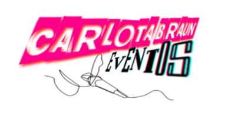

Miembros
 * Antonio Quirante Hernández   
 * Pablo Borrego Megías
 * Jordi Conde Molina

----- 

# Proceso de Diseño 

## Paso 1. UX Desk Research & Analisis 

 1.a Competitive Analysis
-----

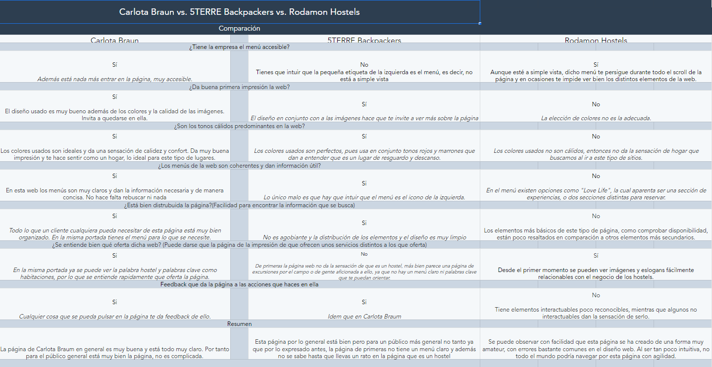

Para el análisis de competidores hemos buscado dos hostels más del extranjero, para poder comparar con el nuestro (Carlota Braun Granada). La elección de esos Hostels se ha hecho en relación a una página donde nos aparecían los mejores hostels del mundo y escogimos dos de ahí.

 1.b Persona
-----
### Persona 1: Reginal Miles

Se ha escogido este usuario para representar a las personas las cuales tengan problemas de socializar dentro un sitio en el cual están prácticamente obligados a socializar, por tanto representa la demografía de la gente super introvertida y que quiere viajar de forma barata.

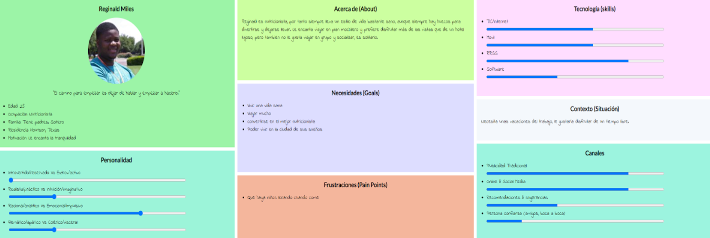

### Persona 2: Andrea Gallego Manchón

Se ha escogido este usuario para representar a un demográfico bastante común, alguien no tan hecho a estar con gente que no conoce, pero interesado en el bajo precio ya que sólo busca un sitio para dormir.

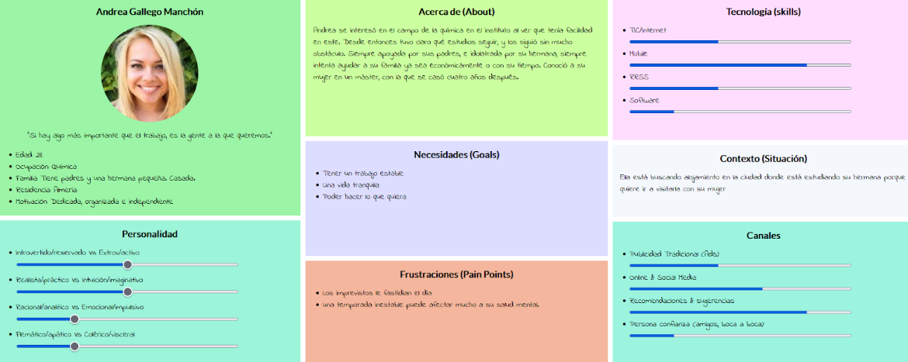

 1.c User Journey Map
----
### Journey Map Reginal Miles
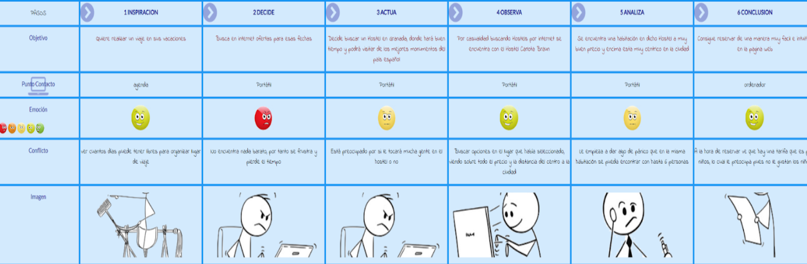

Como mi personaje tiene una personalidad bastante “introvertida” y “asocial”, se ha realizado un journey map representando los problemas con los cuáles puede encontrarse Reginald, como pueden ser los problemas sociales y con niños que pueden originarse en este tipo de sitios.

### Journey Map Andrea Gallego Manchón
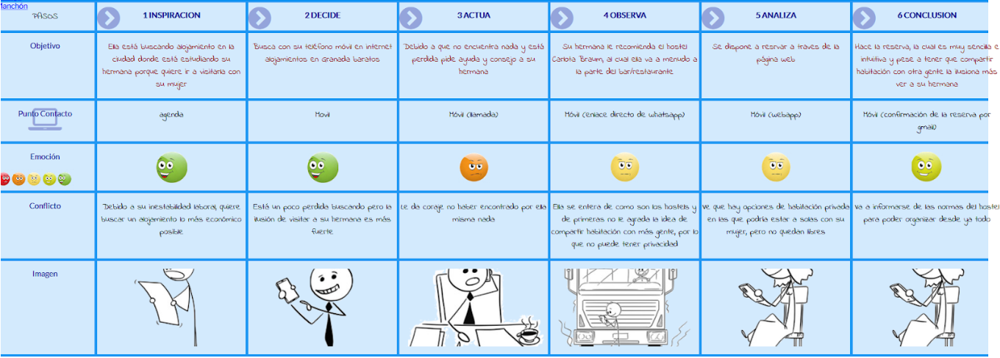

La idea detrás de este personaje es alguien que generalmente no estaría interesado en este tipo de alojamiento, pero por las condiciones (ser una visita y no unas vacaciones, una mala temporada en el trabajo que lleva a preocupación económica, etc) pasa a ser una opción atractiva.

 1.d Usability Review
----
La página web de Carlota Braun nos ofrece de manera clara y rápida todos sus servicios disponibles y los diseños y distribuciones utilizados hacen muy intuitiva la página web.

## Paso 2. UX Design  

 2.a Feedback Capture Grid / EMpathy map / POV
----

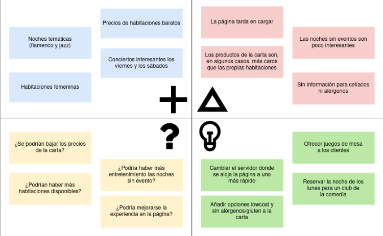

 Interesante | Críticas     
| ------------- | -------
  Preguntas | Nuevas ideas
  
    
Nuestra propuesta para añadir más contenido y eventos a Carlota Braum es lo siguiente: 
Al igual que existen cada miércoles y jueves un evento musical en el local, de música salsa y jazz respectivamente, también se podría hacer otro tipo de eventos otros días.
Entonces hemos pensado en hacer un evento llamado “#Funny” cada lunes de 21:30 a 23:00 el cual consistirá en que habrá un cómico invitado (se intentará que sea de categoría) el cual hará monólogos y hará chistes para sacar las carcajadas de los allí presentes. Después se dejarán los últimos momentos de la velada para que quien quiera se anime  a contar chistes. También se añadirá unas opciones de compartir en redes los eventos y poder opinar sobre ellos. Se podrá reservar una mesa para poder asegurar ir al evento.

También el restaurante lo cambiaremos y añadiremos una opción que permite ver alimentos sin gluten y añadiremos una carta vegetariana.

 2.b Tasks analysis 
-----. 

Viendo que en la página web de Carlota Braun se pueden hacer numerosas cosas hemos decido escoger la opción a, task matrix, en la cuál mostrar la prioridad que tienen estos diferentes grupos de personas cuando entran en la página web.

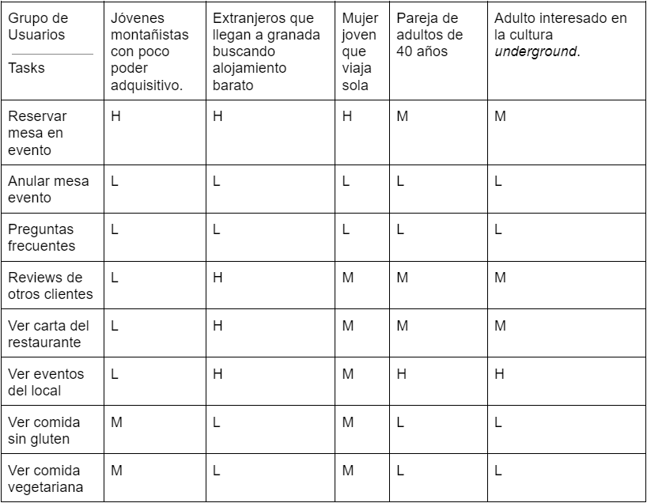

 2.c Sitemap

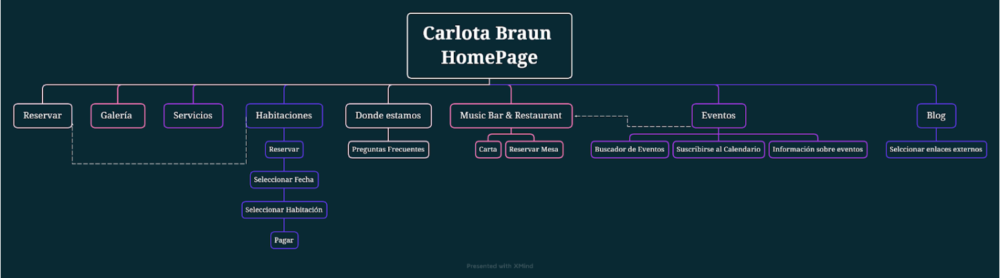

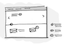 2.d Wireframes
-----

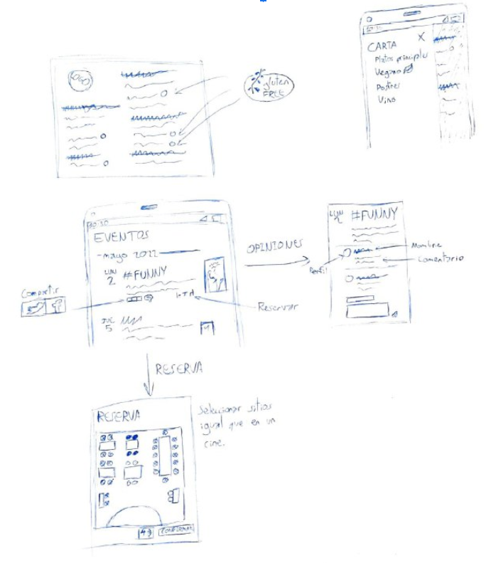

## Paso 3. Mi UX-Case Study (diseño)

 3.a Moodboard
-----

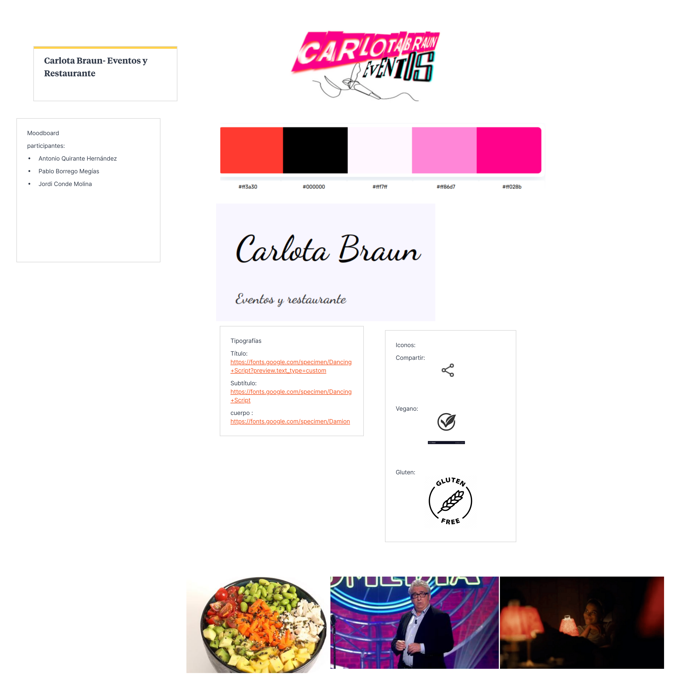

  3.b Landing Page
----

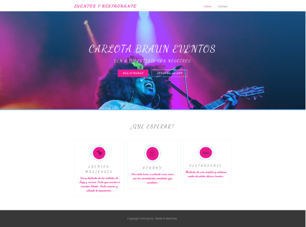

 3.c Guidelines
----
**Logotipo**

Tras algunos cambios y después de desechar algunos diseños, el logotipo final sería este:

**Paleta de Colores**

Tras inspirarnos en los colores de la página web del carlota braun y de además incluir algunos nuevos, nuestra paleta de colores se quedaría tal que así:

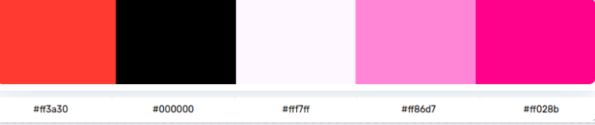

**Tipografía**

Para la tipografía hemos elegido dos principalmente, para los títulos y para los subtítulos utilizaremos la tipografía llamada Dancing Script, dejando un ejemplo a continuación de como se ve:

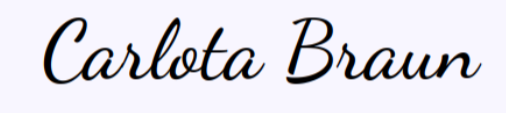

Y para el cuerpo de la página hemos elegido la tipografía Damion, el cuál se ve de esta forma:

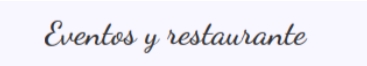

**Iconografía**

Los iconos los hemos buscado de forma que tengan una temática hipster y minimalista además de dar así una apariencia estilizada parecida a la que tiene la página web Carlota Braun.

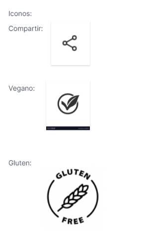

**Patrón de diseño**

Como patrón de diseño hemos utilizado de primeras uno llamado **Continuous Scrolling** el cuál se utiliza cuando queremos mostrar una cantidad de información en una página pero no se puede mostrar en toda su totalidad en pantalla al mismo tiempo, por tanto se utiliza una funcionalidad de “scroll” donde con el dedo vamos desplazando la información; esto ayuda al usuario a la hora de navegar por la página.

  3.d Mockup
----

La página principal de nuestra aplicación mostrará los distintos eventos que hay programados para este mes y el siguiente:

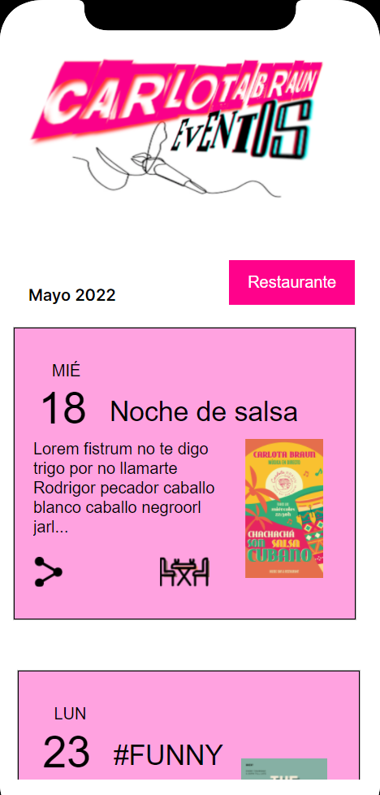

Esta página cuenta con función scroll para poder ver todos los eventos en la misma página. Si se pulsa el icono de compartir te llevará a Twitter para poder compartir el evento, y si se pulsa el icono de la mesa y las sillas pasará a la pestaña de reserva.

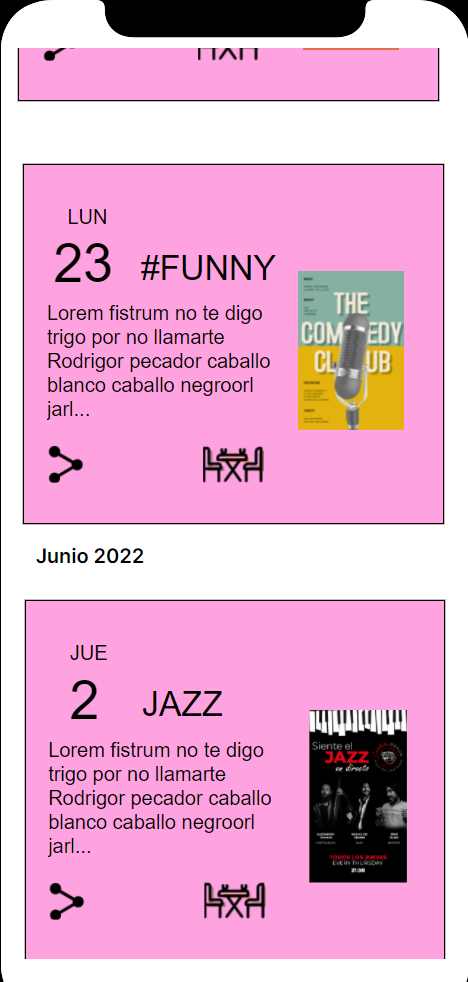

La página de reservas se verá un esquema de las mesas y sillas del lugar, en rojo las ya ocupadas y en verde las disponibles para reservar.

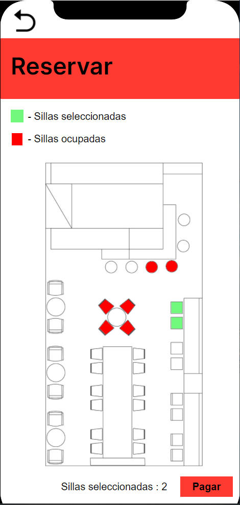

Una vez elegidas las sillas y mesas que se quiera, si le le pulsa ne el botón pagar te llevará a la página de pago.

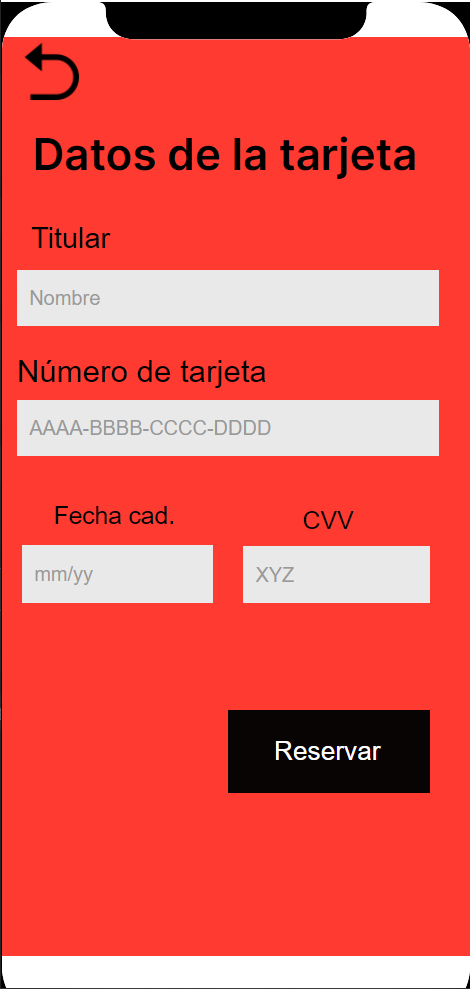

La página de pago es estándar, te pide los datos básicos de tarjeta.

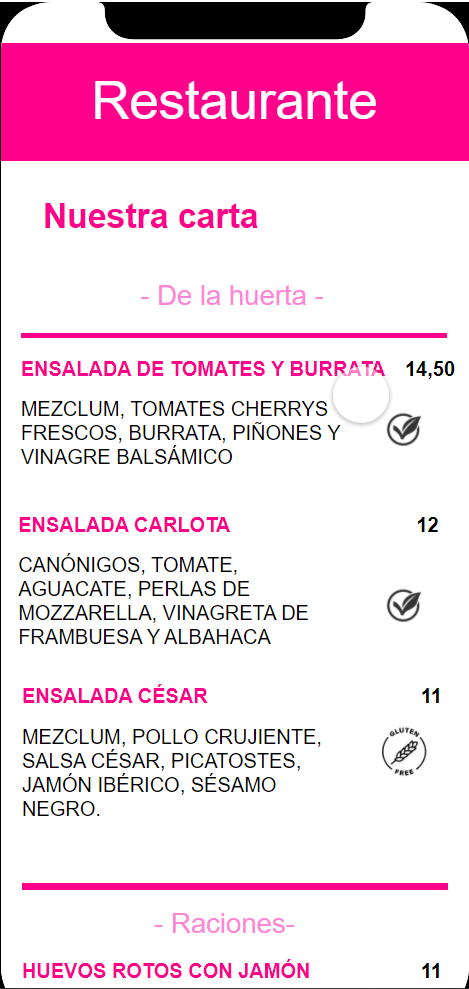

Si en la página principal pulsamos el botón de restaurante se abrirá la página del restaurante con la carta que ofrece. Si el producto es vegano será indicado con un icono, igual para pruductos sin gluten. Todas las páginas tienen un icono para volver a la página anterior. Para estudiar la usabildad del prototipo : https://cloud.protopie.io/p/7771d81c81?touchHint=true&ui=true&scaleToFit=true&cursorType=touch&mockup=true&bgColor=%23F5F5F5&playSpeed=1&playerAppPopup=true

 3.e ¿My UX-Case Study?
-----

>>> Publicar my Case Study en Github..
>>> Documente y resuma el diseño de su producto en forma de video de 90 segundos aprox

## Paso 4. Evaluación 

 4.a Caso asignado
----

>>> Breve descripción del caso asignado con enlace a  su repositorio Github

 4.b User Testing
----

>>> Seleccione 4 personas ficticias. Exprese las ideas de posibles situaciones conflictivas de esa persona en las propuestas evaluadas. Asigne dos a Caso A y 2 al caso B
 

| Usuarios | Sexo/Edad     | Ocupación   |  Exp.TIC    | Personalidad | Plataforma | TestA/B
| ------------- | -------- | ----------- | ----------- | -----------  | ---------- | ----
| User1's name  | H / 18   | Estudiante  | Media       | Introvertido | Web.       | A 
| User2's name  | H / 18   | Estudiante  | Media       | Timido       | Web        | A 
| User3's name  | M / 35   | Abogado     | Baja        | Emocional    | móvil      | B 
| User4's name  | H / 18   | Estudiante  | Media       | Racional     | Web        | B 

. 4.c Cuestionario SUS
----

>>> Usaremos el **Cuestionario SUS** para valorar la satisfacción de cada usuario con el diseño (A/B) realizado. Para ello usamos la [hoja de cálculo](https://github.com/mgea/DIU19/blob/master/Cuestionario%20SUS%20DIU.xlsx) para calcular resultados sigiendo las pautas para usar la escala SUS e interpretar los resultados
http://usabilitygeek.com/how-to-use-the-system-usability-scale-sus-to-evaluate-the-usability-of-your-website/)
Para más información, consultar aquí sobre la [metodología SUS](https://cui.unige.ch/isi/icle-wiki/_media/ipm:test-suschapt.pdf)

>>> Adjuntar captura de imagen con los resultados + Valoración personal 

 4.d Usability Report
----

>> Añadir report de usabilidad para práctica B (la de los compañeros)

>>> Valoración personal 

>>> ## Paso 5. Evaluación de Accesibilidad  (no necesaria)

>>>   5.a Accesibility evaluation Report 
>>>> ----

>>> Indica qué pretendes evaluar (de accesibilidad) sobre qué APP y qué resultados has obtenido 

>>> 5.a) Evaluación de la Accesibilidad (con simuladores o verificación de WACG) 
>>> 5.b) Uso de simuladores de accesibilidad 

>>> (uso de tabla de datos, indicar herramientas usadas) 

>>> 5.c Breve resumen del estudio de accesibilidad (de práctica 1) y puntos fuertes y de mejora de los criterios de accesibilidad de tu diseño propuesto en Práctica 4.

## Conclusión final / Valoración de las prácticas

>>> (90-150 palabras) Opinión del proceso de desarrollo de diseño siguiendo metodología UX y valoración (positiva /negativa) de los resultados obtenidos  

